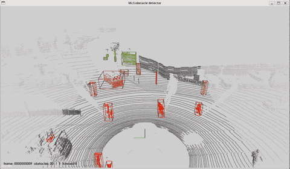

# MLS Obstacle Detection

A compact C++17/PCL demo for obstacle detection in vehicle LiDAR point clouds. The pipeline crops the region of interest, downsamples the cloud, segments the ground, clusters obstacles, and projects the labels back onto the original point order and resolution.

## Demo



## Features

- Accepts a single PCD or KITTI Velodyne BIN file, or a directory of frames.
- Uses YAML configuration for filtering, segmentation, clustering, coloring, and playback.
- Provides an optional interactive PCL viewer and a headless batch mode.
- Writes labeled binary-compressed PCD files, per-frame JSON metadata, the resolved configuration, and a run summary.
- Includes unit tests and a small synthetic point cloud for a self-contained smoke test.

## Requirements

- A C++17 compiler
- CMake 3.20 or newer
- PCL 1.15
- CLI11, yaml-cpp, nlohmann/json, and GoogleTest

The provided Conda environment installs all build and test dependencies from `conda-forge`.

## Build

```bash
conda env create -f environment.yml
conda activate mls-obstacle-detection
cmake -S . -B build -DCMAKE_BUILD_TYPE=Release
cmake --build build -j
ctest --test-dir build --output-on-failure
```

For a machine without a graphical display or X11 development files, configure with `-DMLS_BUILD_VIEWER=OFF`.

## Quick start

Run the bundled synthetic point cloud in headless mode:

```bash
./build/mls_obstacle_detector \
  --config config/highway.yaml \
  --input testdata/synthetic_highway.pcd \
  --output output \
  --no-viewer
```

To process your own data, replace the input and output paths:

```bash
./build/mls_obstacle_detector \
  --config config/highway.yaml \
  --input <pcd-or-kitti-bin-file-or-directory> \
  --output <output-directory> \
  --no-viewer
```

The input source is selected automatically. A file must use the lowercase `.pcd`
or `.bin` suffix. For a directory, direct-child frame files are inspected; unrelated
files and nested directories are ignored. A directory containing both `.pcd` and
`.bin` frames is rejected so that each run has one unambiguous input format.

BIN input uses the KITTI Velodyne layout: each point is four little-endian `float32`
values in `x, y, z, reflectance` order. KITTI BIN files do not carry a sensor pose,
so the reader uses a zero origin and identity orientation. Results are still written
as labeled PCD and JSON files.

Omit `--no-viewer` to launch the interactive viewer. Its initial camera is fitted behind and above the vehicle, looking along the vehicle's `+X` forward axis. The controls are:

| Key | Action |
| --- | --- |
| Space | Pause or resume playback |
| Right / N | Advance one frame while paused |
| R | Restart playback |
| F | Restore the fitted forward view |
| Q / Esc | Exit |

The playback rate comes from `playback.fps` in the YAML configuration and can be overridden with `--fps`. Add `--overwrite` to reuse a non-empty output directory and `--fail-fast` to stop at the first invalid frame.

## Output

Each successful frame produces a binary-compressed labeled PCD and schema-v3 JSON metadata. Filtered cluster point counts, AABBs, and touched boundary faces are included for diagnosis. `filtered_cluster_raw` is a diagnostic subset of `unclustered_raw`, not a separate semantic class. `resolved_config.yaml` and `run_summary.json` describe the run. Exit status is 0 on full success, 2 when bad frames were skipped, and 1 for startup/global failures or fail-fast termination.

Obstacle colors are controlled by `color.palette`, `color.min_distance`, and `color.max_distance`. The default `red_green` palette maps the minimum distance to red and the maximum distance to green, with a yellow midpoint. The `magma` palette provides a dark-to-bright alternative; distances outside the configured range are clamped.
